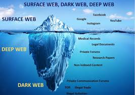
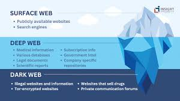
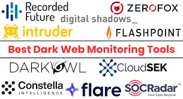

# Dark Web Investigations: Tools, Techniques, and Challenges

## Table of Contents
- [Introduction](#introduction)  
- [Understanding the Dark Web](#understanding-the-dark-web)  
- [Structure of the Dark Web](#structure-of-the-dark-web)  
- [Tools Used in Dark Web Investigations](#tools-used-in-dark-web-investigations)  
- [Techniques and Methodologies](#techniques-and-methodologies)  
  - [Digital Evidence Collection Workflow](#digital-evidence-collection-workflow)  
  - [Example: Cryptocurrency Tracing](#example-cryptocurrency-tracing)  
- [Challenges in Dark Web Investigations](#challenges-in-dark-web-investigations)  
- [Role of Digital Forensics](#role-of-digital-forensics)  
- [Real-World Cases](#real-world-cases)  
- [Conclusion](#conclusion)  
- [References](#references)  

---

## Introduction

The **Dark Web** represents a hidden layer of the internet that cannot be accessed through conventional browsers or search engines. While it serves as a haven for privacy and anonymity, it also provides a platform for **cybercrime, illegal trading, and organized digital offenses**.  

Investigating criminal activity on the Dark Web is a critical part of **Cyber Crime Investigation and Digital Forensics**. Investigators must employ advanced tools and methodologies to trace digital footprints, monitor illegal marketplaces, and collect admissible evidence—all while maintaining operational security and adhering to legal boundaries.  

This article explores the **tools, techniques, and challenges** associated with Dark Web investigations, providing insights into the intersection of **forensics, cybersecurity, and law enforcement**.

---

## Understanding the Dark Web

The internet can be visualized as three layers:

1. **Surface Web:** The publicly accessible and indexed portion of the internet (e.g., Google, YouTube, Wikipedia).  
2. **Deep Web:** Content not indexed by search engines, such as private databases, intranets, and academic records.  
3. **Dark Web:** A small but influential part of the Deep Web accessible only through specialized software like **Tor (The Onion Router)**.  

The **Dark Web uses encryption and routing mechanisms** to conceal the identities and locations of users and websites. While it has legitimate uses (such as secure communication and whistleblowing), it also facilitates **illegal trading, cyber fraud, and data breaches**.

---

## Structure of the Dark Web

A typical Dark Web ecosystem includes:

- **Darknet Marketplaces:** Platforms for trading illegal goods (drugs, malware, stolen data).  
- **Forums and Chatrooms:** Communication hubs for hackers and criminal groups.  
- **Hidden Services:** Websites with `.onion` domains operating through the Tor network.  
- **Cryptocurrency Exchanges:** Mediums for financial transactions using Bitcoin, Monero, and other privacy coins.  

These components collectively form a **decentralized and anonymous environment**, making conventional investigative techniques challenging to apply.

---

## Tools Used in Dark Web Investigations

Dark Web investigators rely on a combination of open-source and enterprise-grade tools for monitoring, evidence collection, and analysis.

### Common Tools (2025)

1. **Tor Browser and Tails OS** – Provide secure and anonymous access to hidden services.  
2. **Maltego** – Visual link analysis to map data relationships across online identities.  
3. **OWASP TorBot** – A Python-based crawler for `.onion` sites that indexes hidden services [web:42].  
4. **OnionScan** – Scans hidden websites for vulnerabilities and metadata exposure [web:44].  
5. **Ahmia.fi** – Specialized dark web search engine that indexes legal `.onion` domains [web:44].  
6. **Chainalysis / CipherTrace** – Blockchain forensics to trace illicit cryptocurrency flows [web:39][web:41].  
7. **MISP (Malware Information Sharing Platform)** – Collects and shares dark web threat intelligence [web:42].  
8. **ZeroFox and Recorded Future** – Use AI and threat intelligence for dark web monitoring and alerting [web:43].  
9. **Autopsy / FTK / EnCase** – Forensics suites for examining captured data and preserving chain of custody.

---

## Techniques and Methodologies

Dark Web investigations combine **digital forensics**, **threat intelligence**, and **ethical cybersecurity practices**. Investigators require robust operational frameworks to avoid exposure and preserve data integrity.

### Common Techniques

- **Undercover Infiltration:** Creating covert identities to observe criminal activities.  
- **OSINT (Open Source Intelligence):** Gathering insights from accessible online data.  
- **Blockchain Analysis:** Tracing cryptocurrency transfers between exchanges and wallets.  
- **Traffic Fingerprinting:** Identifying hidden service correlations through traffic patterns.  
- **Evidence Imaging:** Capturing full forensic snapshots for legal admissibility.  

---

### Digital Evidence Collection Workflow

1. **Incident Report or Tip-Off**  
   Investigation begins with a report or identification of suspicious activity.

2. **Intelligence Gathering (OSINT)**  
   Relevant open-source intelligence is collected to build initial leads.

3. **Access Dark Web via Secure Environment**  
   Investigators enter the dark web using anonymized tools like Tor and isolated operating systems.

4. **Identify and Monitor Suspicious .onion Sites**  
   Monitoring begins on targeted hidden services/websites associated with criminal activity.

5. **Collect Digital Evidence (Screenshots, Logs, Data Dumps)**  
   Digital artifacts such as screenshots, forum logs, and database dumps are systematically collected.

6. **Trace Cryptocurrency Transactions**  
   Analysts use blockchain tools to follow the flow of funds between wallet addresses.

7. **Correlate Identities and Metadata**  
   Identity linkage and metadata analysis reveal associations between online aliases, emails, or IP addresses.

8. **Preserve and Hash Evidence**  
   All collected evidence is securely preserved and hashed for integrity verification.

9. **Report Generation and Legal Submission**  
   Final technical and legal reports are prepared and submitted to appropriate authorities.

---

### Example: Cryptocurrency Tracing

Most Dark Web transactions are conducted using cryptocurrencies such as **Bitcoin** or **Monero**.  
Using blockchain forensics tools like **Chainalysis**, investigators can map wallet transactions and identify financial flows:

1. Identify vendor wallet on a marketplace.  
2. Trace transaction history through blockchain exploration tools.  
3. Correlate addresses with exchange data to identify suspect accounts.  

This tracing method has been crucial in dismantling dark web markets such as **Silk Road** and **AlphaBay**, aiding global law enforcement operations.

---

## Challenges in Dark Web Investigations

Despite technological progress, investigators face numerous persistent obstacles:

1. **Anonymity and Encryption:** Multi-node Tor routing conceals IP origins and destinations.  
2. **Volatile Environments:** Marketplaces frequently change domains or vanish overnight.  
3. **False Data and Disinformation:** Content is often fabricated to mislead analysts.  
4. **Jurisdictional Barriers:** Hosting servers often span multiple countries.  
5. **Ethical and Legal Limitations:** Accessing restricted content risks legal violations.  
6. **Technical Complexity:** Advanced knowledge of networking, forensics, and law is required [web:42][web:43].

---

## Role of Digital Forensics

Digital forensics ensures that evidence gathered from the Dark Web is **authentic**, **preserved**, and **legally admissible**.

Key principles include:

- **Chain of Custody:** Every interaction with evidence is logged.  
- **Data Integrity:** Cryptographic hashing (SHA-256, MD5) ensures authenticity.  
- **Compliance:** Investigations adhere to frameworks such as the **Budapest Convention on Cybercrime (2001)** and national cyber laws.  
- **Reporting:** Clear documentation facilitates judicial interpretation and validation.  

By maintaining forensic rigor, investigators bridge the gap between intelligence collection and legal action.

---

## Real-World Cases

1. **Silk Road (2013):** The pioneering darknet market dismantled using blockchain tracing and undercover infiltration.  
2. **AlphaBay (2017):** Global joint FBI–Europol operation uncovered through cryptocurrency forensics and exploit analysis.  
3. **Operation Onymous (2014):** Coordinated Europol effort that seized over 400 onion domains across multiple servers.  
4. **Hansa Market (2017):** Dutch National Police covertly took control of the marketplace to track illegal transactions in real time.  

---

## Conclusion

Dark Web investigations represent a critical frontier in modern **cybersecurity, intelligence, and forensic science**.  
As technology evolves, so do anonymization tools and encryption methods that challenge investigators.  

By integrating **open-source intelligence (OSINT), blockchain analytics, AI-driven threat monitoring**, and strict forensic principles, investigators can effectively identify illicit actors, uncover hidden communications, and contribute to global cyber justice.  

Continuous skill development through platforms such as **TryHackMe’s Cybersecurity 101 Path** reinforces this capability, nurturing the next generation of digital forensics and investigative professionals.

---

## References

- TryHackMe. *Cybersecurity 101 Path*, 2025.  
- Neotas. *Using the Dark Web for OSINT Investigations*, 2024.  
- AmericasPG. *Exploring Challenges in Dark Web Investigation Using OSINT Techniques*, 2024.  
- JISCR. *A Comprehensive Framework for Dark Web Forensic Tools*, 2024.  
- SentinelOne. *Dark Web Monitoring Tools – 2025 Overview*, 2025.  
- SOCRadar. *Dark Web Monitoring with Open-Source Tools and Services*, 2025.  
- CloudSEK. *Future of Dark Web Monitoring – Trends to Watch in 2025*, 2025.  
- Brandefense. *Top Open Source Intelligence (OSINT) Tools for the Dark Web*, 2025.  
- Europol & FBI. *Operation Onymous Technical Report*, 2017.  
- Chainalysis. *Crypto Crime and Blockchain Forensics Report*, 2023.
